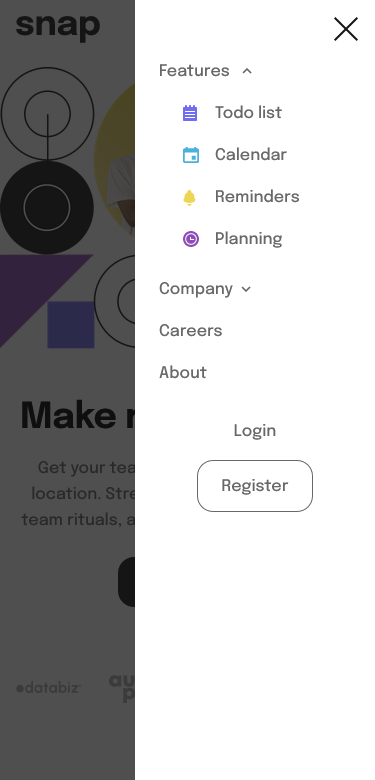

# Frontend Mentor - Intro section with dropdown navigation solution

This is a solution to the [Intro section with dropdown navigation challenge on Frontend Mentor](https://www.frontendmentor.io/challenges/intro-section-with-dropdown-navigation-ryaPetHE5). Frontend Mentor challenges help you improve your coding skills by building realistic projects. 

## Table of contents

- [Overview](#overview)
  - [The challenge](#the-challenge)
  - [Screenshot](#screenshot)
  - [Links](#links)
- [My process](#my-process)
  - [Built with](#built-with)
  - [What I learned](#what-i-learned)
  - [Continued development](#continued-development)
  - [Useful resources](#useful-resources)
- [Author](#author)

## Overview

### The challenge

Users should be able to:

- View the relevant dropdown menus on desktop and mobile when interacting with the navigation links
- View the optimal layout for the content depending on their device's screen size
- See hover states for all interactive elements on the page

### Screenshot

#### Desktop


#### Mobile




### Links

- Solution URL: [Frontend Mentor](https://www.frontendmentor.io/profile/StijnvdW)
- Live Site URL: [Page hosted on GitHub Pages](https://stijnvdw.github.io/frontend-mentor-intro-section-with-dropdown-navigation-main/)

## My process

### Built with

- Semantic HTML5 markup
- CSS custom properties
- Flexbox
- CSS Grid
- Mobile-first workflow
- [Tailwind CSS](https://tailwindcss.com/) - CSS framework

### What I learned

#### Tailwind CSS

First time setting up a project using Tailwind CSS. Lessons learned:
 - Configuring and extending the installation using the config file
 - make use of Tailwind CSS utilities

#### CSS Grid

The global lay-out of page was done using CSS grid desktop makes use of 5 grid columns; ``` auto minmax(auto, 540px) auto 480px auto ``` Taking a mobile first approach the order of the columns and rows in the grid are reordered using the ```order``` attribute.

#### Dropdown menu

Add the desktop menu using only html/css by using CSS :hover selector. When hovering over a navigation item the relevant flexbox is displayed instead of hidden.

```css
:is(.feature-nav-item:hover, .company-nav-item:hover) .desktop-dropdown-menu {
  display: block;
}
```

#### Hamburger menu

JavaScript functions were required to catch the touch/click events to show or hide parts of the menu.
The menu required a to be on top of the main content this was done by adding a div that is shown when menu opens.
This was done by some basic html/CSS and JavaScript, important is to add a z-index to cover the main content.
```html
<div id="mobile-menu-background" class="absolute hidden z-1 top-0 right-0 h-full w-full"></div>
```
```css
#mobile-menu-background {
  background: #151515;
  mix-blend-mode: normal;
  opacity: 0.75;
}
```
```js
function openMobileMenu(params) {
    let mobileMenu = document.getElementById('mobile-menu');
    let mobileMenuBackground = document.getElementById('mobile-menu-background');
    mobileMenu.style.display = 'block';
    mobileMenuBackground.style.display = 'block';
}
```

### Continued development

There are still a few todo's that require some development:
- [nice to have] intro text on desktop doesn't match designs due e.g. title, intro text
- [nice to have] list of clients width is incorrect on desktop
- [nice to have] hide mobile menu when resizing to desktop
- [nice to have] combine mobile and desktop menu html/css
- [nice to have] dropdown shadows on desktop

### Useful resources

- [Tailwind CSS dos](https://tailwindcss.com/docs/) - This helped me setup Tailwinds and understanding which utilities are available.
- [W3Schools Hover Dropdowns](https://www.w3schools.com/howto/howto_css_dropdown.asp) - This is an amazing article which helped me create the Hover Dropdowns
- [MDN Web Docs](https://developer.mozilla.org/en-US/docs/Web/CSS/position) - Made me better understand position and offset.

## Author

- Frontend Mentor - [@yourusername](https://www.frontendmentor.io/profile/StijnvdW)
- GitHub - [@StijndvdW](https://github.com/StijnvdW)
- Twitter - [@StijnvdW86](https://www.twitter.com/StijnvdW86)